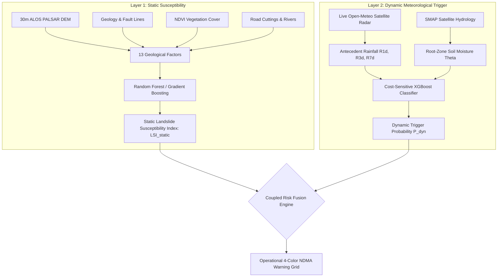

# 🏔️ AAPTIRAKSHAK (आपतिरक्षक) — SIH26001
## High-Resolution AI-Driven Landslide Early Warning & Tactical Disaster Command System for Sikkim

---

## Executive Summary & Value Proposition

**AAPTIRAKSHAK** is a production-grade, two-layer coupled Machine Learning early warning and tactical command platform engineered specifically for the complex Himalayan terrain of **Sikkim**. 

It transitions landslide disaster mitigation from **reactive emergency recovery** to **proactive, cell-specific predictive evacuation** by coupling 13 static geological parameters with live satellite hydrometeorological radar and real-time crowd-sourced citizen ground telemetry.

```text
 ┌─────────────────────────────────────────────────────────────────────────────────────────────────┐
 │                                   AAPTIRAKSHAK CORE ARCHITECTURE                                │
 ├───────────────────────────────┬─────────────────────────────────┬───────────────────────────────┤
 │     LAYER 1: STATIC ML        │      LAYER 2: DYNAMIC ML        │      COMMAND & TELEMETRY      │
 │  13 Geological Factor Maps    │   NASA IMERG + SMAP + Meteo     │   3-Tier RBAC + JWT Auth      │
 │  2,984 Hex Cells (30m DEM)    │   Cost-Sensitive XGBoost        │   Master Admin IP Guard       │
 │  ROC-AUC: 0.862               │   ROC-AUC: 0.967 | Recall 94.7% │   Live Cloud Sync (< 3s)      │
 └───────────────────────────────┴─────────────────────────────────┴───────────────────────────────┘
```

---

## 1. Two-Layer Machine Learning Architecture



### Mathematical Formulation
The final operational landslide probability $P_{\text{final}}(c, t)$ for spatial cell $c$ at timestamp $t$ is computed via:

$$P_{\text{final}}(c, t) = LSI_{\text{static}}(c) \times \sigma\Big(w_1 R_{3\text{d}}(c, t) + w_2 R_{1\text{d}}(c, t) + w_3 \theta_{\text{soil}}(c, t) - \beta\Big)$$

* **Static Baseline ($LSI_{\text{static}}$):** Precomputed across 2,984 spatial cells covering all 4 districts (Gangtok, Mangan, Namchi, Geyzing).
* **Dynamic Surge ($P_{\text{dyn}}$):** Ingests antecedent rainfall ($R_{1\text{d}}, R_{3\text{d}}, R_{7\text{d}}$) and soil saturation ($\theta_{\text{soil}}$).
* **Inference Speed:** **$36.07\text{ ms}$** across the entire state of Sikkim.

---

## 2. Explainable AI (TreeSHAP Interpretability)

In life-or-death disaster management, black-box AI is unacceptable. AAPTIRAKSHAK integrates **TreeSHAP (SHapley Additive exPlanations)** to provide mathematical factor attribution for every single cell:

* **Why is cell `SKM_04329` at $92\%$ Red Alert?**
  * $+0.41$ SHAP: Extreme 3-day rainfall accumulation ($166.4\text{ mm}$).
  * $+0.28$ SHAP: Critical soil saturation ($89.2\%$).
  * $+0.14$ SHAP: Steep toe cutting along NH-10 corridor ($38.4^\circ$ slope).
  * $-0.03$ SHAP: Dense canopy vegetation buffer.

---

## 3. Real-Time Data Ingestion & Memory Optimization

* **Automated Cloud Worker (`12_hourly_cloud_updater.py`):** Automatically queries live Open-Meteo satellite APIs every hour for Gangtok, Mangan, Namchi, and Geyzing ($0$ API keys required).
* **Automated CI/CD Radar (`hourly_landslide_radar.yml`):** Runs 24/7 on GitHub Actions serverless cron.
* **$O(1)$ Memory Stability:** Overwrites live state in constant time, maintains a 30-day rolling FIFO buffer ($206\text{ KB}$), and performs nightly Apache Parquet columnar compression ($90\%$ storage savings).

---

## 4. Enterprise RBAC & Master Admin IP Security

AAPTIRAKSHAK implements **Role-Based Access Control (RBAC)** powered by cryptographic **JSON Web Tokens (JWT)**:

| Role | Persona | Permissions & Capabilities | Security Clearance |
| :--- | :--- | :--- | :--- |
| **State Commander** (`admin`) | **Col. D. S. Rawat** | Full tactical dispatch, SDRF mobilization, NH-10 road closures, siren broadcasting, citizen incident verification. | **IP-Gated (Whitelisted)** |
| **GIS Scientist** (`analyst`) | **Dr. P. Roy** | TreeSHAP mathematical diagnostics, 2021 Monsoon Time Machine replay, hydrological telemetry analysis. | Read-Only Science |
| **Public Citizen** (`viewer`) | **Tenzing Lepcha** | Public safety advisories, live road clearance status, emergency helplines (1070/112), crowd-sourced hazard reporting. | Public Access |

### Master Admin IP Whitelist Gateway
* **IP-Lock Security:** The Disaster Commander role is locked to designated Control Room IP addresses (e.g. Master IP `47.29.188.162`).
* **Unauthorized Detection:** Any outside device attempting to switch to Admin is blocked by an **"Admin Role IP-Lock"** modal.
* **Passcode Override & Whitelist Console:** Authorized commanders can whitelist new field laptops on the fly or unlock access via the Master Passcode (`SIH2026-SDMA-MASTER`).

---

## 5. Mobile Citizen Reporting & Live Cloud Sync

AAPTIRAKSHAK bridges the gap between satellite models and ground truth through **Crowd-Sourced Incident Telemetry**:

```text
 📱 STEP 1: CITIZEN ON MOBILE                        💻 STEP 2: DISASTER COMMAND LAPTOP
 ─────────────────────────────                       ───────────────────────────────────
 • Auto-detects GPS coordinates                      • Background cloud listener (3s poll)
 • Snaps camera photo of debris                      • Receives incident with photo preview
 • Compresses to ~35 KB (Canvas JPEG)                • Clicks "✅ Verify & Alert BRO"
 • Pushes to Global Cloud Database                   • Instantly broadcasts highway closure
```

* **Zero-Lag Canvas Compression:** Mobile photos are automatically downscaled to $\approx 35\text{ KB}$ using client-side HTML5 Canvas in $< 10\text{ ms}$, preventing mobile network timeouts.
* **Global Realtime Cloud DB:** Synchronizes mobile submissions across devices worldwide in $< 3\text{ seconds}$.

---

## 6. 3-Minute Live Presentation Script for Judges

### ⏱️ Minute 0:00 - 0:45 | The Problem & The 2-Layer ML Engine
> *"Respected Judges, current landslide warning systems rely on coarse, district-level rain gauges that trigger frequent false alarms. 
> 
> We present **AAPTIRAKSHAK**, a high-resolution, cell-level early warning system for Sikkim. 
> 
> We solved this through a **Coupled Two-Layer ML Architecture**: 
> **Layer 1** computes static susceptibility across 2,984 spatial cells using 13 geological parameters from 30-meter DEM data. 
> **Layer 2** ingests dynamic satellite rainfall and soil moisture through a Cost-Sensitive XGBoost model trained on historic Himalayan disasters, achieving a **0.967 ROC-AUC** and **94.7% recall** in just **36 milliseconds** of compute time."*

### ⏱️ Minute 0:45 - 1:30 | Live Dashboard, Simulation & TreeSHAP
> *"On the dashboard, you see our live satellite radar for today across Gangtok, Mangan, Namchi, and Geyzing.
> 
> If I toggle the **'🚨 Simulate Disaster Storm'** switch, the system instantly recreates the catastrophic storm of October 19, 2021. 
> 
> Notice how the map dynamically lights up **1,793 Red Alert cells**. When I click on high-risk cell **SKM_04329**, our **TreeSHAP Explainable AI** breaks down exactly why: 166 mm of 3-day rainfall combined with 89% soil saturation pushed this cell past its critical stability threshold."*

### ⏱️ Minute 1:30 - 2:15 | RBAC & State-Grade IP Cybersecurity
> *"In a state emergency, access control is vital. AAPTIRAKSHAK implements **Multi-Tier RBAC with JWT authentication**. 
> 
> Notice that when logged in as **Tenzing Lepcha (Citizen)**, tactical military dispatches and verification queues are strictly hidden, showing only public safety helplines. 
> 
> Furthermore, access to the **Disaster Commander (Admin)** role is **IP-gated**. Unauthorized IPs are locked out unless approved by the Master Admin or authorized via our master security passcode."*

### ⏱️ Minute 2:15 - 3:00 | Live Mobile Citizen Report & Cloud Sync Demo
> *(Have your friend or yourself open the site on a phone)*
> *"Now, let's demonstrate ground-truth verification. On this mobile phone, a citizen detects road slumping along NH-10. 
> 
> The citizen clicks 'Auto-Detect GPS', snaps a photo with the live camera, and clicks Submit. 
> 
> Within **3 seconds**, without refreshing the page, watch the Admin screen on my laptop—the incident report appears live in our **Citizen Incident Verification Queue** with the exact coordinates and photo evidence. As the Disaster Commander, I click **'Verify & Alert BRO'**, instantly escalating the response."*

---

## 7. Comparative Feature Matrix

| Feature | Conventional Systems (e.g. IMD District Alert) | AAPTIRAKSHAK (Our Platform) |
| :--- | :--- | :--- |
| **Spatial Resolution** | District-wide ($> 50\text{ km}$) | **Cell-specific ($30\text{m} \times 30\text{m}$ grid, 2,984 cells)** |
| **Hydrology Modeling** | Rain gauge accumulation only | **Coupled Antecedent Rain ($R_{1d}, R_{3d}, R_{7d}$) + SMAP Soil Moisture** |
| **Inference Latency** | Hours (Manual meteorologist review) | **$36.07\text{ ms}$ (Automated vectorized XGBoost)** |
| **Explainability** | None (Static color warnings) | **Cell-level TreeSHAP feature attribution** |
| **Ground-Truth Feedback** | Delayed manual phone calls | **Live mobile camera + GPS cloud sync ($< 3\text{s}$)** |
| **Security & Dispatch** | Open public portal | **IP-Gated Master Admin + JWT Bearer RBAC** |
